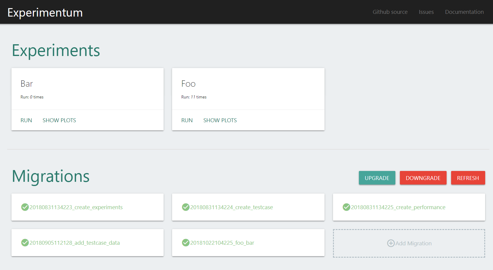

.. experimentum documentation master file, created by
   sphinx-quickstart on Tue Aug 14 13:09:40 2018.
   You can adapt this file completely to your liking, but it should at least
   contain the root `toctree` directive.

Welcome to Experimentum's documentation!
========================================

👨‍🔬🔬Experimentum is a domain-independent data-management framework for running and analyzing computational experiments.

The main purposes of Experimentum are to support experimenters in conducting routine tasks in complex experiments more efficiently.
Experimentum itself takes care of the database-specific parts of the data management:
creating and modifying the database schema, storing the collected experiment results, and retrieving data from the database for further analysis.

    Fig. 1: Web-Interface Dashboard

**Features:**

* Domain-independent
* Independent of used database *(standard is a SQL database, but implementation can be swapped out to support NoSQL databases like MongoDB)*
* Migrations and Schema-builder to easily create the database-schema *(no need to know SQL!)*
* Visualize results with matplotlib
* Manage Experiments via CLI or via Web-Interface

.. toctree::
   :maxdepth: 1
   :caption: Contents:

   install
   configuration
   service
   commands
   migrations
   repositories
   experiments
   API <source/modules>

Indices and tables
==================

* :ref:`genindex`
* :ref:`modindex`
* :ref:`search`
